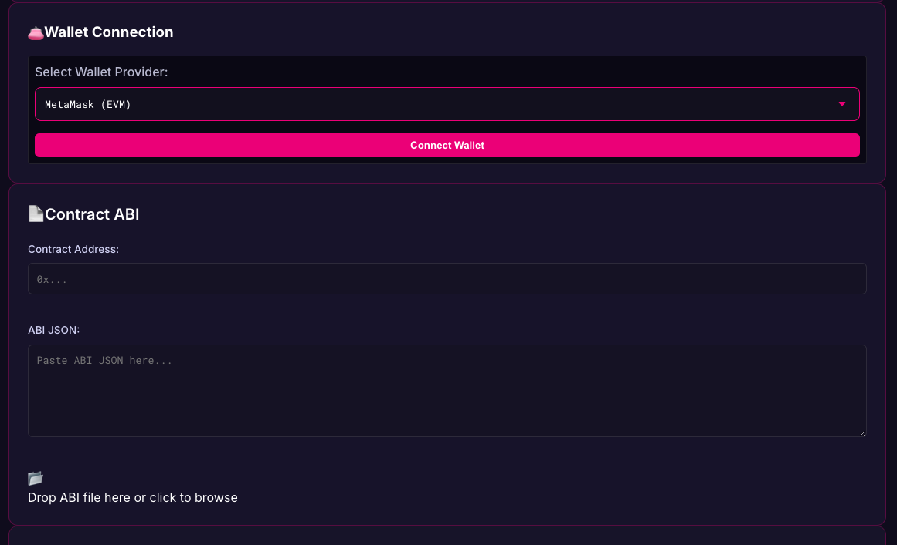

```markdown
# 🔮 Solidity Frontend Library for Polkadot Developers

A lightweight, plug-and-play frontend library designed to help Polkadot developers interact seamlessly with Solidity smart contracts deployed on EVM-compatible parachains like Moonbeam, Astar, and EdgeEVM.

---

## 🚀 Overview

This library bridges the familiar Solidity development experience with the Polkadot ecosystem. Whether you're deploying new contracts or building UIs that interact with existing EVM-based contracts, this toolset makes it easy to connect, deploy, and interact — all using React components powered by Polkadot.js and ethers.js.

---

## ✨ Features

- 🌐 Connect to EVM-compatible parachains (Moonbeam, Astar, Edgeware, etc.)
- 👛 Wallet support: MetaMask, Polkadot.js Extension
- ⚡ Deploy & interact with Solidity smart contracts
- 🔍 Auto-generated UI from ABI
- 🧠 Polkadot-aware tools and metadata support
- 🔧 Developer-friendly utilities (gas estimator, ABI playground, etc.)

---

## 🧩 UI Components

- `<NetworkSelector />` – Select and connect to supported parachains
- `<WalletConnector />` – Connect via MetaMask or Polkadot.js Extension
- `<ContractDeployer />` – Deploy Solidity smart contracts (ABI + bytecode)
- `<ContractInterface />` – Interact with deployed contracts
- `<AbiPlayground />` – Encode/decode contract calls, estimate gas, etc.

---

## 📦 Installation

```bash
npm install @your-scope/polkadot-solidity-ui
# or
yarn add @your-scope/polkadot-solidity-ui
```

---

## 🛠️ Usage

```tsx
import {
  NetworkSelector,
  WalletConnector,
  ContractDeployer,
  ContractInterface
} from '@your-scope/polkadot-solidity-ui';

export default function App() {
  return (
    <div className="space-y-4">
      <NetworkSelector />
      <WalletConnector />
      <ContractDeployer />
      <ContractInterface />
    </div>
  );
}
```

---

## 🔗 Supported Networks

- ✅ Moonbeam / Moonriver
- ✅ Astar / Shiden
- ✅ EdgeEVM
- 🧪 Custom Substrate chains via RPC (experimental)

---

## 🧪 Development

```bash
# Clone the repo
git clone https://github.com/your-org/polkadot-solidity-ui
cd polkadot-solidity-ui

# Install deps
npm install

# Start the dev environment
npm run dev
```

---

## 🤝 Contributing

We welcome contributions! Please open issues or PRs for:
- Bug fixes
- Feature suggestions
- New parachain support
- UX/UI improvements

---

## 📄 License

MIT License © 2025 [Your Name or Org]

---

## 🔮 Vision

> Build once, deploy anywhere — from Solidity to Substrate.  
> Empowering Polkadot developers with Ethereum-style dApp tooling.

---

```

Let me know if you'd like a version with actual code examples or want to scaffold a GitHub repo structure for it too.
