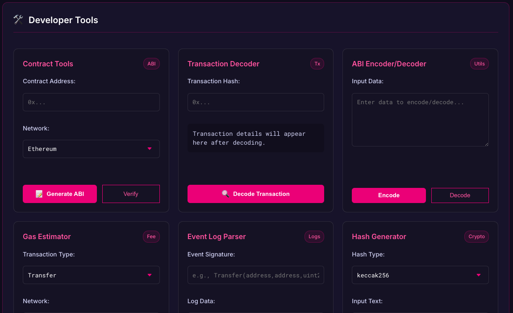

<center>
# EVM Interface Framework for Polkadot
</center>
<div align="center">
  
  
  <p>
    <strong>Bridging Substrate and Solidity Development in the Polkadot Ecosystem</strong>
  </p>
  
  [](https://opensource.org/licenses/MIT)
  [](https://www.npmjs.com/package/@polkadot/solidity-lib)
  [](https://www.typescriptlang.org/)
  [](https://reactjs.org/)
</div>

## 🌉 Overview

The EVM Interface Framework is a specialized toolkit designed to eliminate barriers between Substrate-native and Solidity development within the Polkadot ecosystem. This library provides a unified, intuitive interface for interacting with EVM smart contracts deployed on Polkadot's EVM-compatible environments, while maintaining the familiar development experience Substrate developers expect.

### Key Features

- **Unified Contract Interface** - Interact with EVM contracts using consistent, type-safe patterns
- **Multi-Wallet Support** - Seamless integration with both Polkadot.js and MetaMask wallets
- **Cross-Environment Components** - Ready-to-use React components for common blockchain operations
- **Deployment Utilities** - Simplified contract deployment across Polkadot's EVM environments
- **Developer-Focused Design** - Built by developers, for developers, with DX as the priority

## 🚀 Quick Start

### Installation

```bash
# Using npm
npm install @polkadot/solidity-lib

# Using yarn
yarn add @polkadot/solidity-lib

# Using pnpm
pnpm add @polkadot/solidity-lib
```

### Basic Usage

```tsx
import { useEvmContract, useWallet } from '@polkadot/solidity-lib';
import { PolkadotProvider } from '@polkadot/solidity-lib/core';
import { ConnectButton } from '@polkadot/solidity-lib/components';

// Set up your application
function App() {
  return (
    <PolkadotProvider>
      <YourDApp />
    </PolkadotProvider>
  );
}

// Use in your components
function YourDApp() {
  // Connect to wallets easily
  const { address, isConnected } = useWallet();
  
  // Interact with contracts
  const { read, write } = useEvmContract({
    address: '0xYourContractAddress',
    abi: YourContractABI,
  });
  
  return (
    <div>
      <ConnectButton />
      
      {isConnected && (
        <div>
          <p>Connected: {address}</p>
          <button 
            onClick={() => write.yourContractMethod()}
          >
            Execute Contract Function
          </button>
        </div>
      )}
    </div>
  );
}
```

## 📚 Documentation

Visit our [documentation site](https://docs.polkadot-solidity-lib.io) for comprehensive guides, API references, and examples:

- [Getting Started](https://docs.polkadot-solidity-lib.io/getting-started)
- [Contract Interactions](https://docs.polkadot-solidity-lib.io/contract-interactions)
- [Wallet Integration](https://docs.polkadot-solidity-lib.io/wallet-integration)
- [UI Components](https://docs.polkadot-solidity-lib.io/components)
- [Deployment Utilities](https://docs.polkadot-solidity-lib.io/deployment)
- [Network Configuration](https://docs.polkadot-solidity-lib.io/networks)

## 🧩 Core Components

The framework consists of several key modules that work together to create a seamless development experience:

### Contract Interface

```tsx
// Read contract state
const balance = await read.balanceOf(address);

// Write to contract (returns transaction receipt)
const tx = await write.transfer(recipient, amount);
await tx.wait(); // Wait for confirmation

// Listen to events
useContractEvent({
  contract,
  eventName: 'Transfer',
  listener(from, to, amount) {
    console.log(`Transfer: ${from} → ${to}: ${amount}`);
  },
});
```

### Wallet Management

```tsx
const { 
  connect, 
  disconnect, 
  address,
  chainId,
  isConnected,
  switchNetwork
} = useWallet();
```

### UI Components

```tsx
// Easy wallet connection
<ConnectButton 
  supportedWallets={['polkadot-js', 'metamask']} 
/>

// Network selection
<NetworkSelector 
  networks={['moonbeam', 'astar']} 
/>

// Contract interaction forms
<ContractForm 
  contract={contract}
  method="transfer"
/>
```

## 🌐 Supported Networks

The framework supports all EVM-compatible environments in the Polkadot ecosystem:

- Moonbeam
- Moonriver
- Astar
- Shiden
- Acala EVM+
- Any other parachain supporting the Frontier EVM pallet

## 🛠️ Development

### Prerequisites

- Node.js 16+
- yarn or npm
- Basic knowledge of React and TypeScript
- Familiarity with Polkadot and EVM concepts

### Setup Development Environment

```bash
# Clone the repository
git clone https://github.com/polkadot-js/solidity-lib.git
cd solidity-lib

# Install dependencies
yarn install

# Start development environment
yarn dev
```

### Testing

```bash
# Run unit tests
yarn test

# Run end-to-end tests
yarn test:e2e

# Check test coverage
yarn test:coverage
```

## 🤝 Contributing

We welcome contributions from the community! Please read our [contributing guidelines](CONTRIBUTING.md) before submitting pull requests.

### Development Process

1. Fork the repository
2. Create a feature branch: `git checkout -b feature/amazing-feature`
3. Commit your changes: `git commit -m 'Add amazing feature'`
4. Push to the branch: `git push origin feature/amazing-feature`
5. Open a Pull Request

## 📄 License

This project is licensed under the MIT License - see the [LICENSE](LICENSE) file for details.

## 🙏 Acknowledgements

This project was made possible through funding from the Web3 Foundation and the support of the Polkadot ecosystem community.

Special thanks to:
- The Moonbeam and Astar teams for their EVM implementations
- The Polkadot.js team for their excellent substrate libraries
- All the developers who provided feedback and contributions

---

<div align="center">
  <p>Built with ❤️ for the Polkadot ecosystem</p>
</div